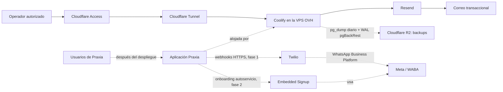

# Estado de infraestructura de producción

**Proyecto:** Praxia  
**Fecha de corte:** 17 de agosto de 2026  
**Entorno:** Producción  
**Estado general:** Fundación operativa; backups externos, despliegue de la aplicación y la habilitación manual de WhatsApp aún están pendientes. El onboarding autoservicio de Meta/Twilio pertenece a la fase 2.

> Este documento registra arquitectura, decisiones y estado operativo. No contiene secretos, tokens, contraseñas, claves API ni direcciones IP.

## Resumen ejecutivo

La base de infraestructura de Praxia ya está configurada sobre una VPS de OVH con Coolify. El acceso administrativo no depende de puertos Docker abiertos a Internet: Cloudflare Tunnel enruta el tráfico hacia el servidor y Cloudflare Access limita la consola de Coolify al propietario autorizado.

El dominio `usepraxia.com` ya está gestionado por Cloudflare. Resend está verificado y habilitado en Coolify para correo transaccional desde `Praxia <noreply@usepraxia.com>`.
El riesgo principal previo a datos reales es la continuidad: la infraestructura opera sobre una sola VPS y aún no hay backups externos en Cloudflare R2. En paralelo se prepara la verificación de negocio de Meta, que puede tardar semanas, pero la integración de onboarding autoservicio de Meta/Twilio queda explícitamente fuera de la fase 1.

## Actualización 2026-08-18

- **APO-26** (`Desplegar el perímetro y recuperación verificable`) está en In Progress y asignado. El criterio de recuperación/Turnstile se movió a **APO-56** (aplicación). La lista viva de pendientes está en `docs/infrastructure/pendientes-produccion.md`.
- **Meta:** la verificación de negocio de K31 SOFTWARE quedó enviada y está **In review** (~2 días hábiles). 2FA requerido para todos en el Business Portfolio; un administrador sin passkey.
- **OVH:** la VPS es modelo **VPS-2 2027** en **Beauharnois (Canadá)**, Ubuntu 24.04. El **backup automatizado de OVH está activo** (último 2026-08-17 23:10). Snapshot desactivado.
- **Twilio:** cuenta `AC81e8ab…` activa con saldo de $20 y unidades gratuitas (100 SMS / 100 WhatsApp / 3000 email / 75 min voz). Sin números ni senders configurados.
- **Cloudflare:** la zona opera en plan **Free** (el ADR 0003 asume Pro). Decisión: permanecer en Free durante el piloto y subir a **Pro** en el go-live para rate limit de login, SBfM y Managed Ruleset completo. Ver `docs/adr/0007-despliegue-produccion-y-recuperacion.md`.
- **Coolify:** v4.3.9. Sin notificaciones habilitadas. Email transaccional por Resend configurado (`Praxia <noreply@usepraxia.com>`). S3 Storage de R2 registrado (Connected).
- **Backups (nuevo):** doble capa activa hacia R2 — pg_dump diario de Coolify (05:00 El Salvador) y pgBackRest con WAL continuo (imagen propia `localhost:5000/praxia-postgres:16` servida por un registro Docker local de la VPS). Primer full y drill de restauración (full y PITR) ejecutados y documentados en `docs/runbooks/restauracion-backup.md`.

## Estado por componente

| Componente | Estado | Resultado actual | Pendiente principal |
|---|---|---|---|
| Dominio y DNS | Activo | `usepraxia.com` delegado a Cloudflare. | Publicar los DNS de la aplicación cuando se despliegue. |
| VPS OVH | Activo | Ubuntu, Docker y Coolify instalados; SSH endurecido. | Mantener actualizaciones y vigilar capacidad. |
| Perímetro Cloudflare | Activo | Tunnel y Access protegen la consola de Coolify. | Revisar acceso al sumar operadores. |
| Resend | Verificado | Dominio y envío desde Coolify habilitados. | Enviar prueba y revisar entregabilidad. |
| Backups externos | Activo | pg_dump diario + pgBackRest/WAL hacia R2; restauración full y PITR probadas 2026-08-18. | Repetir el drill mensualmente y vigilar el cron. |
| Meta / WhatsApp | En curso | Existe un Meta Business Portfolio y está abierta la verificación. | Completar verificación con datos legales correctos y 2FA. |
| Twilio / WhatsApp, fase 1 | Pendiente | Sin sender ni operación manual de la primera clínica. | Definir y ejecutar el runbook manual del piloto. |
| Meta Tech Provider, fase 2 | Pendiente | No se ha implementado onboarding autoservicio. | App Meta, Partner Solution y Embedded Signup. |
| Aplicación Praxia | Pendiente | No hay despliegue de producción registrado. | Conectar repositorio, secretos, base de datos y dominio. |

## Arquitectura configurada

| Flujo | Ruta | Protección y propósito |
|---|---|---|
| Consola administrativa | Operador → Cloudflare Access → Tunnel → Coolify | La consola queda detrás de autenticación Cloudflare; solo la identidad autorizada puede abrirla. |
| Tiempo real y terminal | Coolify → subdominios/rutas específicas → Tunnel → servicio interno | Las rutas específicas del Tunnel evitan que los WebSockets o terminal caigan en la aplicación principal. |
| Correo | Coolify → Resend → destinatario | Resend envía como `Praxia <noreply@usepraxia.com>`. |
| Backups, pendiente | VPS/Coolify → R2 | Copia S3-compatible, privada e independiente de la VPS. |

### Límites intencionales de la primera fase

- Se usa una sola VPS para reducir costo y complejidad durante el piloto. Esto no equivale a alta disponibilidad.
- Cloudflare Access protege la consola administrativa; no reemplaza la autenticación y autorización propias de la aplicación Praxia.
- Los registros de parking y reenvío que existían previamente en el dominio se preservaron mientras no exista una web pública que los sustituya. No deben eliminarse sin validar antes el servicio asociado.

## Trabajo completado

### Dominio y Cloudflare

- El dominio `usepraxia.com` se delegó a Cloudflare mediante los nameservers asignados por Cloudflare. La zona quedó activa.
- Se creó un Cloudflare Tunnel administrado para la VPS de producción y su servicio quedó configurado para iniciar automáticamente en el servidor.
- Se publicaron rutas separadas para la consola de Coolify, los eventos en tiempo real y la terminal web. El orden de las rutas evita conflictos entre tráfico principal y WebSockets.
- Se creó una aplicación de Cloudflare Access para la consola de Coolify.
- La política de acceso se corrigió para permitir únicamente al propietario autorizado: `gv200136@alumno.udb.edu.sv`.

### VPS, red y sistema

- Se instaló Coolify sobre Docker en Ubuntu dentro de la VPS de OVH.
- Se verificó la salud de los servicios principales de Coolify y de sus servicios de tiempo real.
- SSH quedó restringido a autenticación por llave pública: se deshabilitaron contraseña y autenticación interactiva. Root conserva únicamente el acceso por llave autorizada.
- Las reglas persistentes de red permiten SSH como vía directa de administración y bloquean el acceso público directo a los puertos de Docker y Coolify.
- `cloudflared` y las reglas de red quedan activos después de reinicios.

### Coolify y acceso administrativo

- Coolify está publicado a través de un hostname protegido por Cloudflare Access.
- El acceso local por túnel SSH se utilizó únicamente durante la configuración; no es la vía operativa pública.
- La consola se validó con la cuenta Cloudflare autorizada.

### Resend y correo transaccional

- Se añadió y verificó `usepraxia.com` en Resend.
- Se publicaron en Cloudflare los registros necesarios para Resend: DKIM, SPF y el MX de envío bajo el subdominio de envío. Esto no modifica el correo entrante existente del dominio raíz.
- Resend mostró el dominio como **Verified**.
- Se configuró el remitente de Coolify como `Praxia <noreply@usepraxia.com>`.
- Se creó una clave de Resend de privilegio mínimo: solo envío y restringida a `usepraxia.com`.
- La clave se guardó como secreto en Coolify; no está registrada en este archivo ni debe incorporarse al repositorio.
- La entrega por Resend quedó habilitada y Coolify confirmó que actualizó los ajustes.

### Backups físicos con pgBackRest (completado 2026-08-18)

- Imagen propia `praxia-postgres:16` (postgres:16-alpine + pgBackRest 2.58) construida en la VPS y publicada en un registro Docker local (`praxia-registry`, registry:2, bound a 127.0.0.1:5000, datos en `/data/docker-registry`, restart always). Coolify ejecuta `docker compose pull` en cada arranque del recurso, por lo que la imagen debe existir en el registro local; el nombre en el campo Image de Coolify es `localhost:5000/praxia-postgres:16`.
- Secretos S3 en `/data/praxia-pgbackrest/secrets.conf` del host (root:70, 640); el contenedor los recibe por file mount de Coolify (Persistent Storage → Files → Host file mount) en `/etc/pgbackrest/conf.d/secrets.conf`. El campo Custom Docker options de Coolify solo admite flags `--…`; un `-v` ahí se ignora.
- Config de archivado vía campo Custom PostgreSQL configuration de Coolify: `archive_mode=on`, `archive_command='pgbackrest --stanza=main archive-push %p'`, `archive_timeout=60`.
- Stanza `main` creada en R2 (`praxia-production-backups`, prefijo `praxia-pgbackrest`), primer full de 29.4 MB verificado, retención 30 fulls.
- Cron del host: `/etc/cron.d/praxia-pgbackrest` → `/opt/praxia-db/backup-full.sh` (11:30 UTC), log en `/var/log/praxia-pgbackrest.log`.
- Drill de restauración ejecutado y verificado (full ≈ 1 min; PITR ≈ 35 s; WAL en segundos). Pasos y evidencia en `docs/runbooks/restauracion-backup.md`.

## Pendientes priorizados

### P1 — Preparación de identidad Meta (iniciar ahora, no bloquea el código de fase 1)

La pantalla actual de Meta solicita un número de contacto y un sitio web para buscar un registro oficial del negocio. Se debe continuar únicamente con datos reales que coincidan con la entidad y los documentos que se puedan presentar si Meta los solicita. No usar una identidad, número o sitio provisional que no pueda respaldarse.

1. Definir la identidad que operará Praxia ante Meta: nombre legal/comercial, titular, teléfono de contacto, correo de empresa, país/dirección y documentos de respaldo disponibles.
2. Publicar primero un sitio mínimo y real en `usepraxia.com`: qué es Praxia, contacto, aviso de privacidad y términos. Debe corresponder al negocio que se verificará; no es necesario lanzar aún toda la aplicación.
3. Completar la verificación del Meta Business Portfolio con esa información y activar 2FA obligatorio para todos los administradores.
4. Crear un sender propio de Praxia mediante Self Sign-up solo para validar la marca y el canal de Praxia. No confundir este paso con el onboarding de una clínica.

### P1 — WhatsApp con onboarding manual (fase 1)

La fase 1 no incluye **Embedded Signup** en la aplicación. La clínica no se registra sola: una persona de Praxia coordina el alta y conserva evidencia operativa de cada paso.

1. Crear o elegir la cuenta/proyecto de Twilio para el piloto, con facturación y responsable definidos.
2. Preparar la ficha manual por clínica: titular, número E.164, acceso al Business Portfolio/WABA, responsable para OTP, estado del sender, plantilla, opt-in y contrato/privacidad.
3. Acordar con Twilio el camino de alta del primer sender de la clínica. La documentación de Twilio establece que los ISV que incorporan clientes deben usar Tech Provider para sus clientes; el hecho de que el equipo de Praxia acompañe el proceso manualmente no debe asumirse como una exención. Confirmarlo por ticket antes de prometer la fecha del piloto. [Guía de Tech Provider](https://www.twilio.com/docs/whatsapp/isv/tech-provider-program/integration-guide)
4. Configurar el webhook entrante y el callback de estado. El callback queda fuera de Cloudflare Access, Turnstile y desafíos, pero la aplicación valida `X-Twilio-Signature` e idempotencia.
5. Crear y someter las plantillas de confirmación, recordatorio y cancelación; registrar el opt-in antes de iniciar conversaciones salientes y no incluir datos clínicos en las plantillas.
6. Habilitar la primera clínica solo cuando el sender esté `ONLINE`, plantillas y callbacks estén validados y el checklist humano esté cerrado.

### P0 — Backups externos con Cloudflare R2

> **Bloqueador de continuidad:** no se debe considerar protegida la producción hasta contar con backups externos automatizados y una restauración comprobada. Un snapshot del proveedor ayuda, pero no sustituye una copia de base de datos ni una copia independiente de la VPS.

1. Crear un bucket privado de R2 para producción, por ejemplo `praxia-production-backups`.
2. Crear credenciales S3 con alcance mínimo para ese bucket. Guardarlas solo en Coolify o en un gestor de secretos; nunca en el repositorio.
3. Registrar R2 en **S3 Storage** de Coolify.
4. Configurar backups de las bases de datos y volúmenes que se creen con la aplicación.
5. Definir una retención explícita. Punto de partida recomendado: copias diarias por 30 días y semanales por 12 semanas; ajustarla según volumen de datos, presupuesto y obligaciones del producto.
6. Restaurar una copia en un entorno aislado y documentar los pasos y el tiempo de recuperación.

### P1 — Primer despliegue de la aplicación

- Conectar el repositorio de Praxia a Coolify.
- Definir el método de build, el comando de arranque y health checks de cada servicio.
- Crear variables de entorno de producción en Coolify. Los secretos de base de datos, autenticación, Resend y Twilio deben quedar fuera del repositorio.
- Provisionar la base de datos y aplicar migraciones de forma controlada.
- Activar los backups de la base antes de cargar datos reales.
- Asignar el dominio público y subdominios de la aplicación, manteniendo la consola de Coolify separada del producto público.
- Validar de extremo a extremo: autenticación, correo, flujo principal, logs, health check y rollback básico.

### P2 — Onboarding autoservicio de clínicas (fase 2)

Este bloque no es requisito para desplegar la fase 1. Sí debe iniciarse cuando el piloto confirme el flujo operativo y el modelo de datos por clínica.

1. Crear una app nueva de Meta de tipo Business, añadir WhatsApp y solicitar acceso avanzado a `whatsapp_business_messaging` y `whatsapp_business_management`.
2. Enviar la app a revisión y completar la Access Verification de Meta. Preparar URLs HTTPS estáticas para OAuth, términos y privacidad.
3. Abrir el ticket de Twilio para conectar la app aprobada como **Partner Solution** y aceptar la solicitud en Meta.
4. Implementar **Embedded Signup** en Praxia. Cada clínica crea/elige su Business Portfolio y WABA desde la aplicación y Praxia crea la subcuenta Twilio y registra el sender.
5. Mantener el aislamiento: una clínica ↔ una subcuenta Twilio ↔ una WABA. Guardar credenciales únicamente como secretos cifrados del servidor.

> La aprobación de la app Meta y la vinculación con Twilio suelen tardar entre tres y cuatro semanas según Twilio. Aunque sea fase 2, conviene iniciar la verificación de negocio y 2FA desde fase 1 para no comenzar esa espera al terminar el piloto. [Resumen del programa](https://www.twilio.com/docs/whatsapp/isv/tech-provider-program)

### P1 — Prueba de Resend y alertas

- Usar **Send test** en Coolify para confirmar una entrega real y revisar remitente, encabezados y carpeta de spam.
- Crear un canal de notificaciones de Coolify para despliegues fallidos, backups y fallos de servicio. Puede usar el correo ya configurado o un canal adicional.
- Separar el correo transaccional del marketing o correo masivo: proveedor/subdominio, consentimiento y bajas deben decidirse antes de enviar campañas.

### P2 — Operación continua

- Añadir monitoreo externo de los endpoints públicos y alertas ante una caída del Tunnel, Coolify o la aplicación.
- Definir una rutina mensual de actualización de Ubuntu, Docker, Coolify y cloudflared. Tomar una copia verificable antes de cambios mayores.
- Revisar trimestralmente Cloudflare Access, llaves SSH, API keys de Resend/Twilio y miembros con acceso.
- Crear un runbook de incidente: recuperación de acceso, restauración de base, redeploy y rotación de secretos.

## Secuencia recomendada

| Orden | Acción | Responsable | Criterio de cierre |
|---:|---|---|---|
| 1 | Configurar bucket y credenciales R2 | Administrador de Cloudflare / equipo | Bucket privado disponible en Coolify. |
| 2 | Programar backups y restaurar una copia de prueba | Equipo técnico | Restauración verificable y retención definida. |
| 3 | Publicar web mínima y completar verificación/2FA de Meta | Titular del negocio + equipo | Datos verificables, web pública y 2FA activa. |
| 4 | Enviar prueba desde Coolify | Equipo técnico | Correo recibido desde `noreply@usepraxia.com`. |
| 5 | Desplegar aplicación y base de datos | Equipo técnico | Aplicación saludable en dominio público. |
| 6 | Ejecutar onboarding manual de la clínica piloto y validar sender | Equipo técnico + clínica piloto | Sender `ONLINE`, plantillas aprobadas y callbacks validados. |
| 7 | Activar alertas y runbook | Equipo técnico | Un fallo simulado genera una alerta y existe una guía de respuesta. |
| 8 | Fase 2: Tech Provider, Partner Solution y Embedded Signup | Equipo técnico + titular Meta | Onboarding autoservicio disponible por clínica. |

## Decisiones y advertencias operativas

La decisión de operar inicialmente en una única VPS de OVH es costo-eficiente para el piloto y Coolify reduce el esfuerzo de despliegue. Aun así, una caída o pérdida del host afectaría todos los servicios alojados; R2 y una restauración comprobada son el control mínimo de continuidad.

Cloudflare Access protege la consola de administración, no los usuarios de Praxia. La aplicación necesita sus propios controles de autenticación, autorización, sesiones, rutas administrativas y auditoría cuando se publique.

Los secretos generados durante la configuración deben tratarse como información sensible. Si uno se muestra, se pega en un chat, se sube al repositorio o se comparte fuera del equipo, debe revocarse y reemplazarse de inmediato.

## Próximo paso inmediato

Completar Cloudflare R2 con backups automáticos y una restauración de prueba. En paralelo, publicar el sitio mínimo de Praxia y dejar iniciada la verificación/2FA de Meta; esto prepara la fase 2, pero no obliga a construir Embedded Signup antes de ejecutar el piloto manual.
