# Auditoría de la UI de superadmin de Praxia

Fecha: 27 de septiembre de 2026. Superficie: `app.usepraxia.com/apolo` en la pestaña abierta de Helium, con la Clínica «Clinica Tests» seleccionada, más `/apolo/alta`. Se revisó la interfaz visible y su implementación en este repositorio (`268dac95`). No se ejecutaron operaciones que cambien datos.

## Veredicto

La consola contiene las funciones necesarias para el piloto, pero hoy se comporta como una página de diagnóstico técnico a la que se añadieron formularios. El problema visual más grave tiene una causa concreta: la transición al tema claro reescribe parte de las utilidades de color antiguas y deja otras sin adaptar. El resultado visible es texto oscuro sobre tarjetas grises oscuras, acciones pálidas y estados difíciles de distinguir. La estructura agrava el problema: el operador debe leer muchos estados repetidos y recorrer una página de WhatsApp muy larga antes de llegar a la decisión o acción que busca.

La dirección recomendada es conservar las reglas y protecciones del dominio, corregir primero el sistema de color y después separar **supervisión**, **operación por Clínica** y **evidencia técnica**. No hace falta convertir cada dato técnico en una pantalla de primer nivel.

## Recorrido observado

| Paso | Pantalla | Salud | Evidencia |
| --- | --- | --- | --- |
| 1 | Resumen de una Clínica | Crítica: contraste y prioridad visual | [Captura 01](auditoria-superadmin-assets/01-resumen.jpg) |
| 2 | Inicio de WhatsApp: alta y preflight | Deficiente: mezcla de tareas | [Captura 02](auditoria-superadmin-assets/02-whatsapp-inicio.jpg) |
| 3 | Enlace, piloto y operación de WhatsApp | Deficiente: exceso de densidad y bajo contraste | [Captura 03](auditoria-superadmin-assets/03-whatsapp-operacion.jpg) |
| 4 | Pagos y suscripción | Mejorable: acciones sin contexto suficiente | [Captura 04](auditoria-superadmin-assets/04-pagos.jpg) |
| 5 | Soporte auditado | Mejorable: formulario aislado y estado poco visible | [Captura 05](auditoria-superadmin-assets/05-soporte.jpg) |
| 6 | Plantillas | Mejorable: prioriza el catálogo sobre bloqueos | [Captura 06](auditoria-superadmin-assets/06-plantillas.jpg) |
| 7 | Sistema: proveedor y colas | Aceptable en contenido, débil en jerarquía | [Captura 07](auditoria-superadmin-assets/07-sistema.jpg) |
| 8 | Sistema: incidencias | Deficiente: repetición sin agrupación | [Captura 08](auditoria-superadmin-assets/08-incidencias.jpg) |
| 9 | Alta comercial o sintética | Buena base visual, navegación incompleta | [Captura 09](auditoria-superadmin-assets/09-alta.jpg) |
| 10 | Gates de tráfico real y retirada | Deficiente: bloqueos y acciones destructivas comparten una sección extensa | [Captura 10](auditoria-superadmin-assets/10-whatsapp-gates.jpg) |
| 11 | Matriz de evidencia de activación | Útil para auditoría, inadecuada como interfaz operativa principal | [Captura 11](auditoria-superadmin-assets/11-matriz-activacion.jpg) |

### 1. Resumen

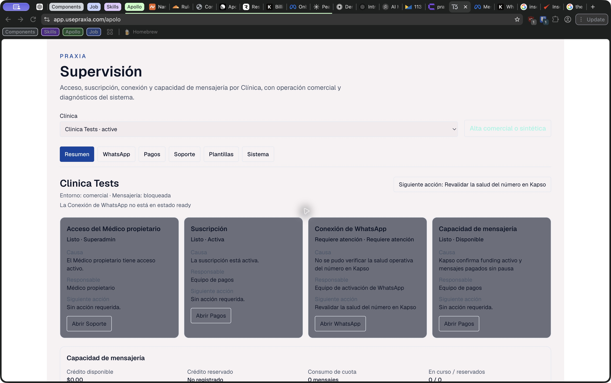

El bloqueo de WhatsApp aparece junto a tres estados «Listo», todos en tarjetas del mismo tamaño. La siguiente acción es una frase sin botón asociado y la tarjeta de WhatsApp solo dice «Abrir WhatsApp»; no lleva al gate concreto. «Capacidad de mensajería» se repite como estado y como bloque de métricas. En la captura se ve «Disponible» junto a crédito `$0.00` y mensajería «bloqueada»: los datos pueden corresponder a dimensiones distintas, pero la UI no explica esa distinción. También aparece «Superadmin» como valor de «Acceso del Médico propietario»; el valor proviene del nombre de la identidad propietaria, por lo que conviene verificar el dato o presentarlo como nombre de cuenta y no como estado.

La composición viene de [`clinic-supervision-summary.tsx`](../../src/app/apolo/clinic-supervision-summary.tsx): cuatro tarjetas uniformes, un `nextAction` textual y cinco métricas. [`clinic-supervision.ts`](../../src/domain/clinic-supervision.ts) distingue correctamente acceso, suscripción, conexión, capacidad y modo de mensajería; el problema es cómo se presentan. El primer estado no listo se elige por orden del arreglo, sin priorización de severidad ni de acción posible.

### 2–3 y 10–11. WhatsApp

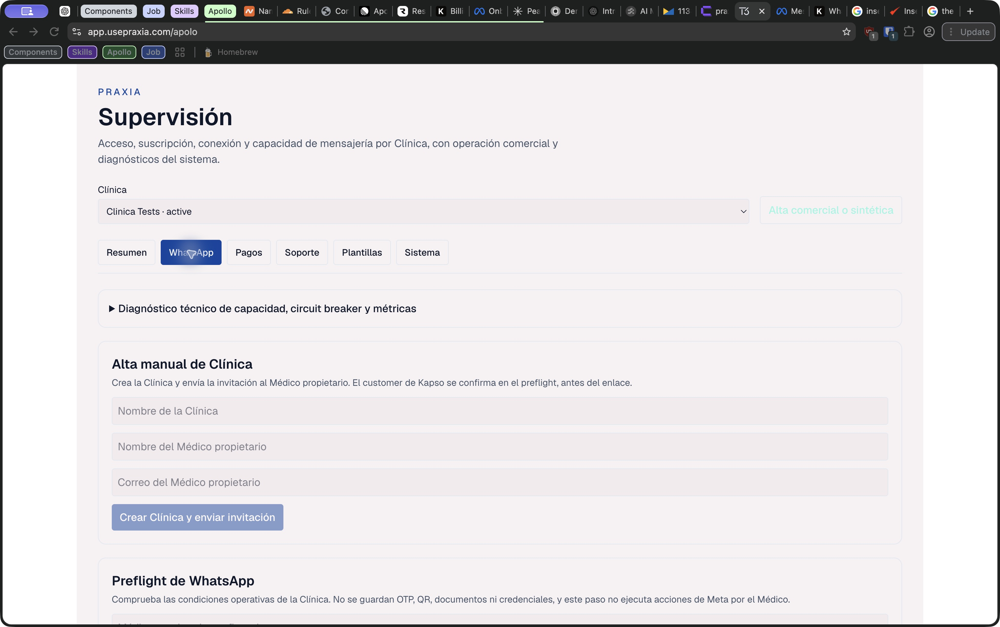

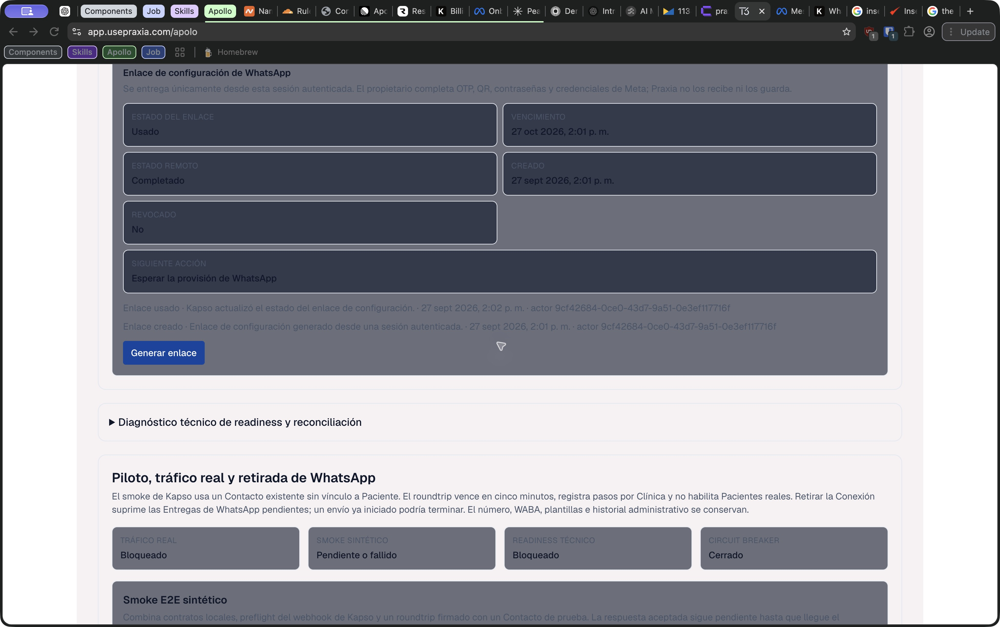

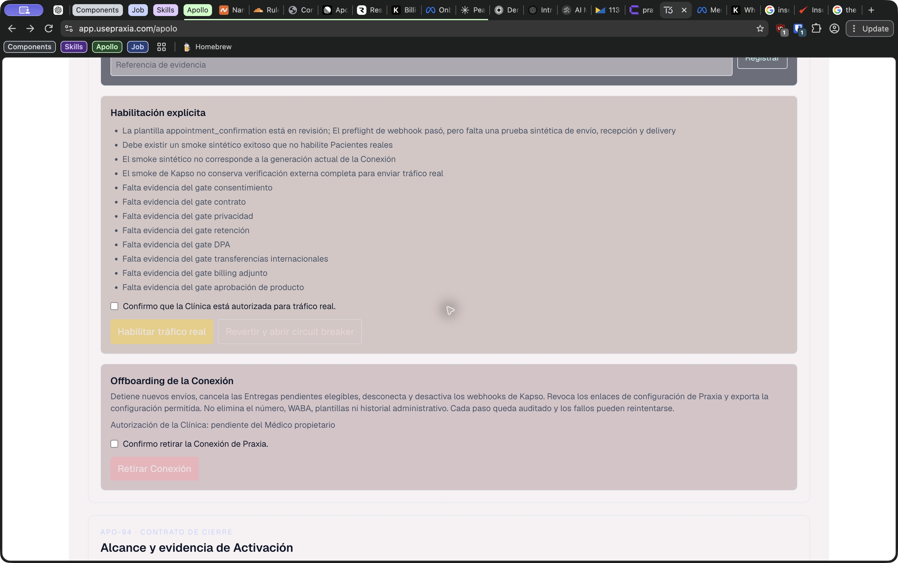

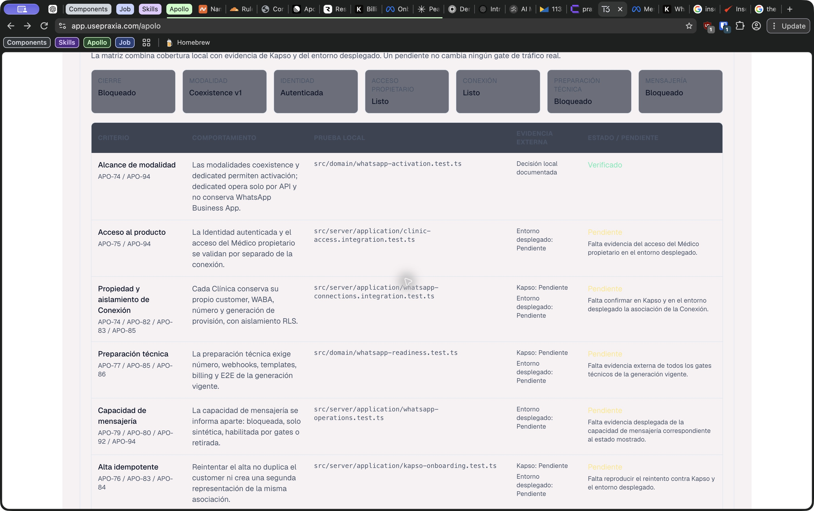

La pestaña reúne en una sola columna: diagnóstico de circuito, **otra** alta manual de Clínica, preflight, enlace, readiness, smoke, ocho gates legales/operativos, habilitación de tráfico, retirada y una matriz extensa de criterios APO. La tarea activa de la Clínica seleccionada no abre la sección pertinente; el operador tiene que encontrarla por desplazamiento. En el enlace, la próxima acción puede decir «Esperar la provisión» mientras se ofrece «Generar enlace» al mismo nivel visual. La matriz muestra nombres de archivos de prueba y tickets APO: sirven como evidencia interna, pero no ayudan a resolver un bloqueo inmediato.

La página principal [`apolo-operations.tsx`](../../src/app/apolo/apolo-operations.tsx) tiene más de 2.600 líneas y concentra estado, consultas, mutaciones y todas estas secciones. La matriz se agrega desde [`whatsapp-activation-closure-section.tsx`](../../src/app/apolo/whatsapp-activation-closure-section.tsx). La alta manual dentro de WhatsApp usa un formulario distinto al de `/apolo/alta`: este último admite tipo comercial/sintético, clave de idempotencia y recuperación de invitación; el formulario de WhatsApp no muestra esas opciones ni la misma recuperación. La duplicación invita a elegir un camino incompleto.

Los gates de seguridad y la confirmación explícita deben permanecer. Lo que debe cambiar es su presentación: un paso de activación con estado, responsable y una acción por vez; diagnóstico y evidencia detallada en un panel secundario. La retirada debe estar en una zona separada, identificada como operación excepcional.

### 4. Pagos

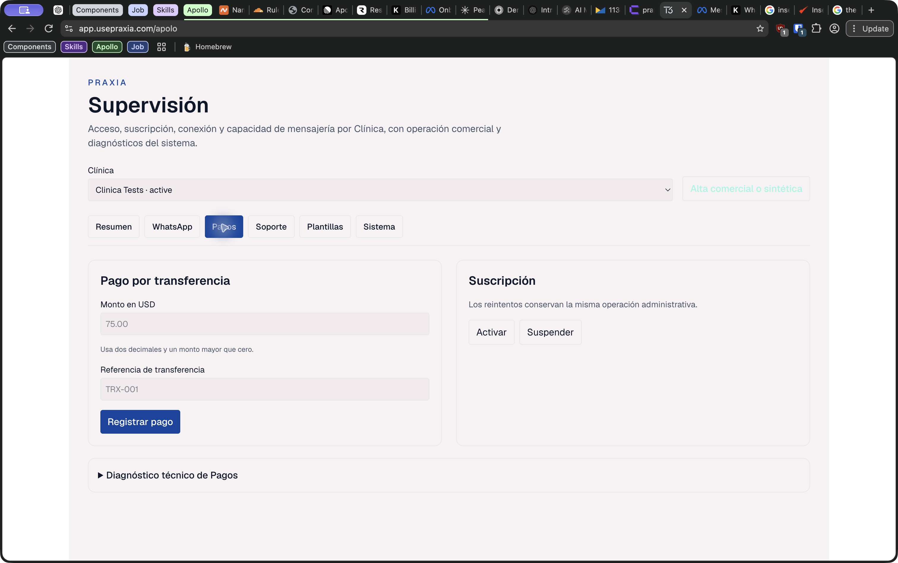

El formulario permite registrar transferencia y activar o suspender, pero no muestra de entrada el estado actual de suscripción, el último pago, la referencia previa ni el efecto inmediato de cada botón. «Activar» y «Suspender» aparecen simultáneamente aunque una de las dos acciones puede no corresponder al estado actual. La lógica de reintento idempotente y el feedback existen en [`apolo-operations.tsx`](../../src/app/apolo/apolo-operations.tsx); conviene mantenerlos, mostrar primero el estado actual y pedir revisión de Clínica, importe y referencia antes de registrar un pago.

### 5. Soporte

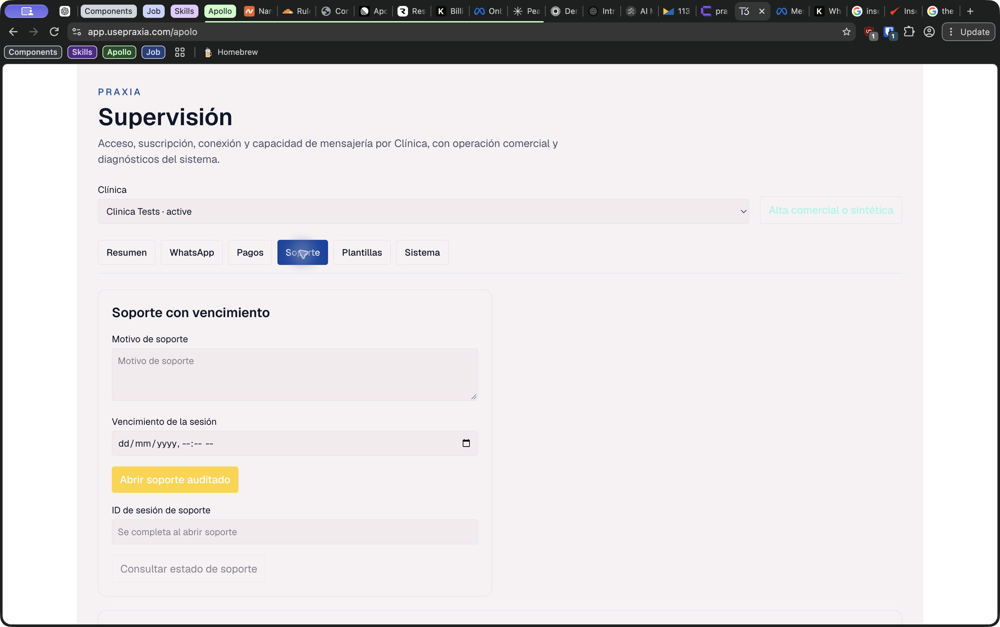

La sección da un motivo, un vencimiento y un ID editable para consultar, pero no enseña una lista de sesiones abiertas o recientes de esa Clínica. El operador no ve quién tiene acceso, hasta cuándo ni cómo cerrarlo desde esta vista. La fecha exige introducir una hora sin sugerir una duración operativa. El formulario y la consulta por ID están en [`apolo-operations.tsx`](../../src/app/apolo/apolo-operations.tsx). Mantener auditoría y vencimiento; añadir estado de sesiones, acceso concedido y revocación si el dominio la permite.

### 6. Plantillas

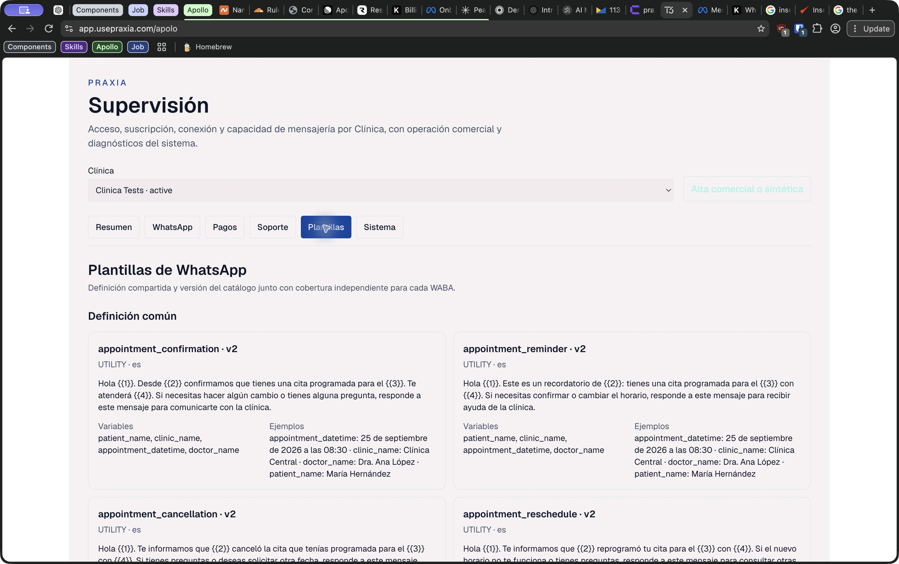

La primera pantalla dedica mucho espacio al texto completo, variables y ejemplos de cuatro plantillas. El bloqueo que importa para la Clínica seleccionada —qué plantilla sigue pendiente y qué falta para usarla— queda abajo, en «Cobertura por WABA». El componente [`supervision-templates.tsx`](../../src/app/apolo/supervision-templates.tsx) consulta un catálogo global y lista todas las WABA; por eso la pestaña cambia de contexto sin avisar: el selector superior sugiere «esta Clínica», pero la sección muestra información transversal. Poner primero la cobertura y los bloqueos de la Clínica seleccionada; mover definiciones y ejemplos a detalles expandibles o a un catálogo global claramente rotulado.

### 7–8. Sistema

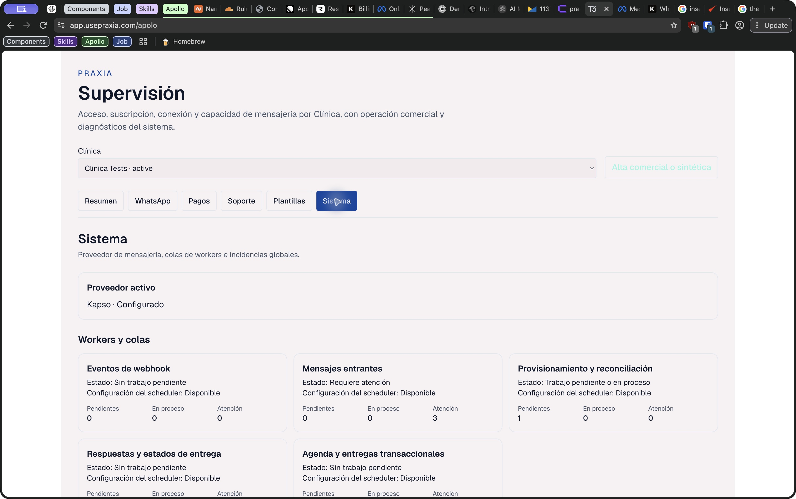

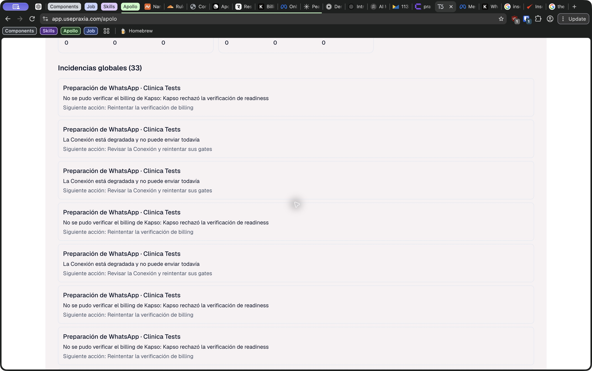

Los contadores de colas son útiles. La lista de «33 incidencias globales» muestra muchas tarjetas casi idénticas de la misma Clínica; no ofrece filtros, agrupación, edad visible, severidad ni vínculo directo con el objeto afectado. Esto impide distinguir 33 problemas independientes de múltiples eventos de dos causas. [`supervision-system.tsx`](../../src/app/apolo/supervision-system.tsx) pinta cada elemento de `globalProblems` como tarjeta. [`supervision-dashboard-store.ts`](../../src/server/db/supervision-dashboard-store.ts) agrega alertas abiertas de varias fuentes, hasta 30 por fuente, sin agrupación para la vista. Conservar el historial crudo, pero presentar incidencias activas agrupadas por Clínica, causa y recurso, con recuento, primera/última aparición y ruta de resolución.

### 9. Alta

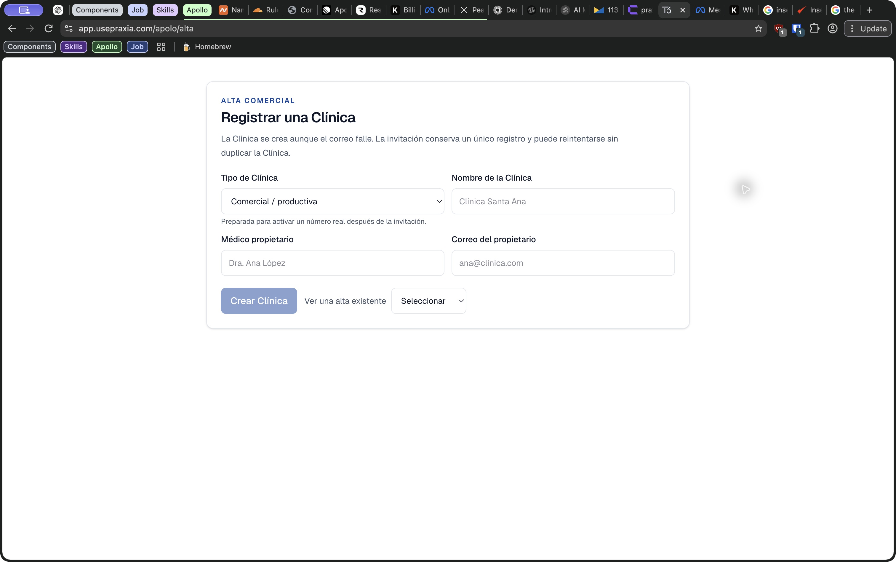

Esta pantalla ya usa los tokens claros y tiene etiquetas, explicación del tipo de Clínica, recuperación e idempotencia. Es la base más consistente. Se abre como ruta separada desde la consola, sin regreso visible; al volver con el navegador se perdió la Clínica seleccionada y hubo que elegirla otra vez. El selector y la pestaña activa viven solo en `useState` en [`apolo-operations.tsx`](../../src/app/apolo/apolo-operations.tsx). Persistir el contexto en la URL y añadir una ruta de regreso explícita.

## Hallazgos priorizados

| Prioridad | Hallazgo y evidencia | Causa en código | Cambio propuesto |
| --- | --- | --- | --- |
| P0 | Contraste insuficiente en tarjetas, campos y texto de ayuda (pasos 1, 3, 10, 11). | [`globals.css`](../../src/styles/globals.css) redefine `.bg-slate-950` y `.bg-slate-900`, pero no variantes como `bg-slate-900/60`; cambia `text-slate-100` a texto oscuro sobre esos fondos. | Retirar el puente global para esta consola y migrar todas sus superficies a tokens semánticos claros. Revisar combinaciones reales de primer plano/fondo, incluidos disabled, bordes y foco. |
| P0 | El resumen no dirige al bloqueo concreto (paso 1). | `nextAction` se renderiza como texto; los destinos son pestañas genéricas. | Tarjeta principal de «Qué bloquea la operación» con causa, dueño, última verificación y acción contextual; secundarios compactos. |
| P1 | Dos flujos de alta con capacidades distintas (pasos 2 y 9). | Alta duplicada en `apolo-operations.tsx` y `clinic-registration-panel.tsx`. | Quitar el formulario de alta de WhatsApp; usar exclusivamente `/apolo/alta`, con regreso a la Clínica creada y siguiente paso de activación. |
| P1 | WhatsApp mezcla ejecución, diagnóstico, evidencia y retirada (pasos 2, 3, 10, 11). | Un único panel largo en `apolo-operations.tsx` más la matriz completa. | Convertirlo en flujo por etapas: conexión, preparación, prueba, autorización, habilitación. Mostrar solo etapa actual y pendientes; detalles técnicos bajo demanda; retirada en operación excepcional. |
| P1 | Incidencias duplicadas ocupan la vista (paso 8). | `globalProblems.map` de alertas crudas. | Agrupar por causa/recurso, ordenar por severidad y antigüedad, añadir filtros y destino. |
| P1 | Contexto de Clínica se pierde al navegar a alta o recargar (paso 9). | `clinicId` y `activeTab` solo en estado local. | Ruta o parámetros de URL que conserven Clínica y sección; regreso visible. |
| P2 | Plantillas globales parecen pertenecer a la Clínica elegida (paso 6). | Consulta global dentro de pestañas de detalle por Clínica. | Separar «Plantillas de esta Clínica» del catálogo global. |
| P2 | Pagos y soporte carecen de historial y estado actual inmediato (pasos 4–5). | Los paneles priorizan formularios. | Mostrar estado, último evento y consecuencias antes de las acciones. |
| P2 | Consultas de WhatsApp se crean al seleccionar Clínica aunque no se abra esa pestaña. | Los hooks de `apolo-operations.tsx` se habilitan por `clinicId`, no por `activeTab`. | Cargar por sección cuando sea posible; medir antes de atribuir impacto de rendimiento. |

## Propuesta de estructura

1. **Inicio global:** Clínicas con bloqueos, incidencias agrupadas, trabajos que requieren intervención y búsqueda de Clínica. «Sistema» queda como observabilidad transversal.
2. **Ficha de Clínica:** estado operativo claro; acceso, suscripción, conexión y capacidad como señales distintas; una cola de próximas acciones ordenada por impacto y responsable.
3. **Operaciones de Clínica:** WhatsApp por etapas, pagos y soporte con historial. Plantillas de esa WABA junto a la preparación técnica.
4. **Evidencia avanzada:** trazas, IDs, pruebas locales y matriz APO en un espacio de auditoría accesible desde el contexto correspondiente, sin desplazar el trabajo cotidiano.

## Qué quitar, conservar y añadir

- **Quitar de la vista principal:** alta manual duplicada en WhatsApp; las cuatro tarjetas de idéntico peso; la repetición de «Capacidad de mensajería»; filas individuales de incidencias iguales; catálogo completo y matriz APO como contenido inicial.
- **Conservar:** distinción de estados del dominio, gates de tráfico real, confirmaciones explícitas, idempotencia, auditoría de soporte, historial de evidencia y diagnósticos desplegables.
- **Añadir:** resumen global de trabajo pendiente, acción contextual por bloqueo, navegación con URL, historial de pagos y soporte, agrupación de incidencias, hora de última comprobación y estados que expliquen «funding disponible» frente a «envío bloqueado».

## Accesibilidad y límites de la revisión

El contraste deficiente se observa en las capturas y se explica por las clases de color; debe medirse por combinación final para contrastarlo con WCAG. En WhatsApp, los tres campos de la alta manual dependen de `placeholder` y carecen de `<label>` visible en el código, aunque Helium expuso nombres por el placeholder. Hay pestañas con roles ARIA y navegación con flechas en [`supervision-tabs.tsx`](../../src/app/apolo/supervision-tabs.tsx), un punto a conservar. No se verificaron lector de pantalla, teclado completo, zoom, móvil ni valores de contraste calculados. Tampoco se enviaron pagos, invitaciones, pruebas de transporte ni cambios de acceso en producción. Los estados de Kapso cambiaron durante la observación; las capturas representan instantes de esta sesión, no un estado permanente.

## Orden de ejecución sugerido

1. Corregir el tema y validar visualmente las seis secciones y los estados disabled; esto elimina el defecto que impide leer con comodidad.
2. Eliminar el alta duplicada y conservar contexto en la URL.
3. Rehacer el resumen alrededor de bloqueos y acciones, usando la información ya disponible en el dominio.
4. Dividir WhatsApp en etapas y mover matriz/diagnósticos a vistas secundarias.
5. Agrupar incidencias y dar contexto histórico a pagos, soporte y plantillas.
